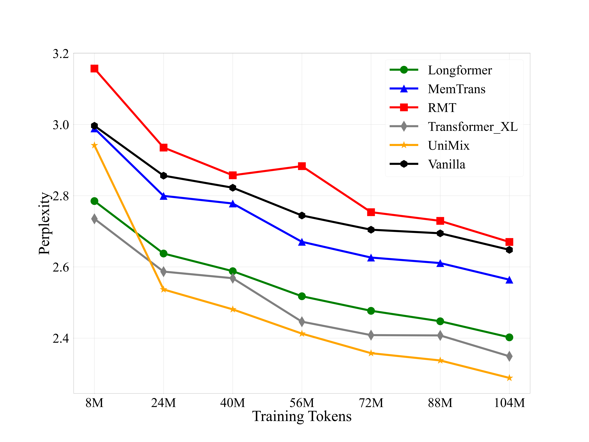
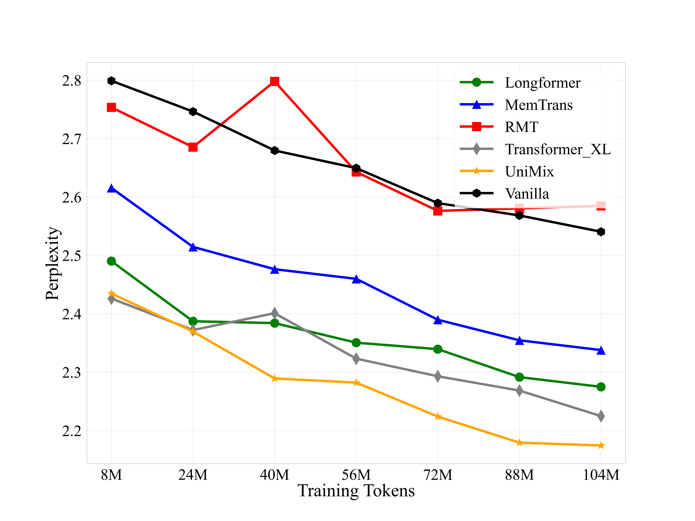

# UniMem_Exp
Impact of Fine-Tuning Data

We trained the TinyLLaMA-1.1B and LLaMA2-7B models using the GitHub dataset. The figures below illustrate the perplexity changes as the training data volume increases from 4 million to 104 million tokens (0.1 billion).

## Figure 1: Perplexity Curves of TinyLLaMA on the GitHub Dataset

## Figure 2: Perplexity Curves of LLaMA2-7B on the GitHub Dataset

